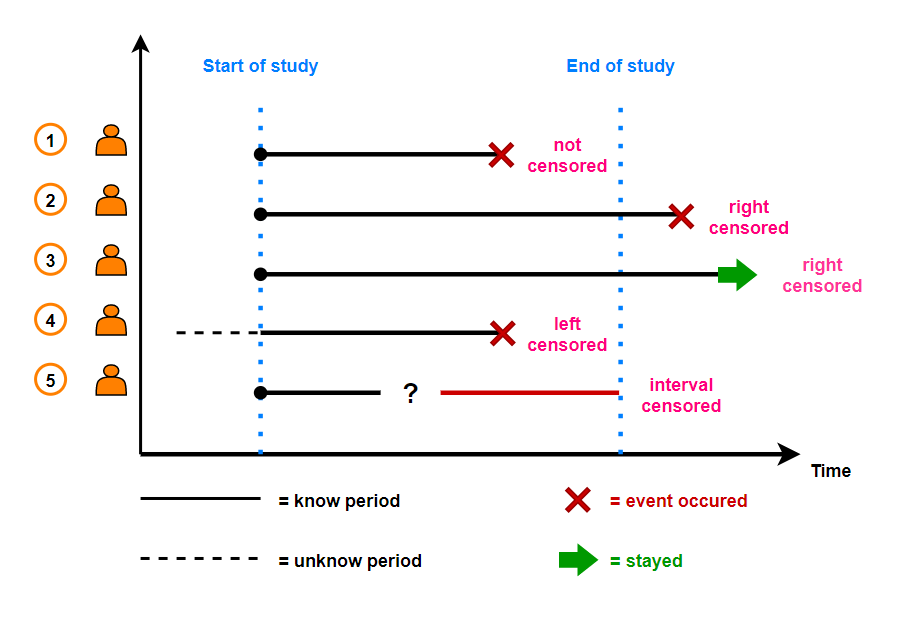
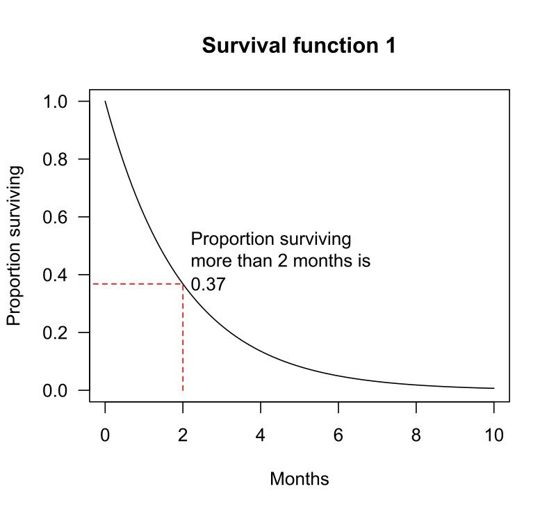
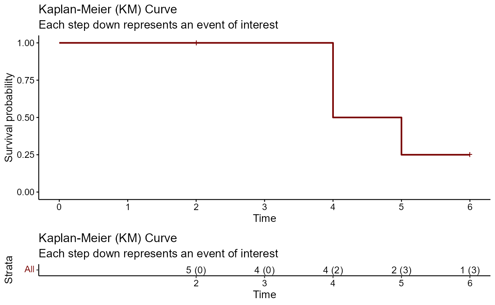
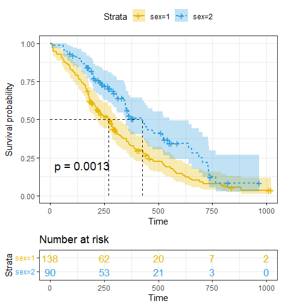

```{r setup, include = FALSE}
library(knitr)
library(rmarkdown)
xaringanExtra::use_panelset()
xaringanExtra::use_clipboard()
# set default options
# opts_chunk$set(dpi = 300)
```

class: title-slide, left, bottom

# `r rmarkdown::metadata$title`
----
## **`r rmarkdown::metadata$subtitle`**
### `r rmarkdown::metadata$author`
### `r rmarkdown::metadata$date`

---

# .green[목차]

.left-column[
]
.right-column[

 - .content-box-green[기초개념]
  
- .content-box-green[생존 함수 추정]

  - Kaplan-Meier method
  - 실습
  
- .content-box-green[생존 함수 비교]
  
  - Log rank test
  - 실습
  
- .content-box-green[위험인자 분석]

  - Cox proportional hazard model
  - Time dependent Cox proportional hazard model
  - 실습

<!-- 위험인자 분석 또한 생존함수 추정방법에 해당 -->
<!-- 위험함수 h(t)와 생존함수 S(t) 사이에는 관계식이 있고 하나를 알면, 하나를 유도할수 있음 h(t) = f(t)/S(t) -->
  
]

---

class: inverse, middle, center

# 기초개념

---

## .green[생존 분석]

- 생존자료(survival data)를 분석하는 통계적 방법

## .green[생존 자료]

- 관심 사건의 발생 여부(이진형 변수)와 생존시간(연속형 변수)을 관측한 자료

  - 생존자료를 사건-시간 자료(time-to-event data)라 표현하기도 함
  
  - 실제 생존 시간(true survival time, .red[T]) = 추적 시작 시점 ~ 사건 발생 지점

<!-- 관심사건은 사망, 질병 발생/재발/호전, 금연, 퇴사 등이 될 수 있음-->
<!-- 단위: days, weeks, months, years -->

- 생존 자료의 가장 큰 특징: 중도 절단(censored)

  - 중도 절단 시간 (censoring time, .green[C])
      - 연구기간 내 사건 미발생 시 마지막 추적 시점까지의 시간
  
  - 관측 생존 시간 (observed survival time) = min(.red[T], .green[C])
      - 연구기간 내 생존 시간 또는 중도 절단 시간까지의 시간
      
<!-- 즉, 관측 생존 시간 $\neq$ 실제 생존 시간 -->

---

## .green[생존 자료의 특징]

.pull-left[
 - 생존 시간은 정규분포를 따르지 않음

  - 항상 양의 값
  - 매우 치우친 분포
  
- 중도 절단
  - Type I censoring
  - Type II censoring
  - Type III censoring
      - loss to follow up
      - drop out
     
  <!-- 사전에 중도절단시간 고정 e.g. 연구종료시점 정해놓은 경우 -->
  <!-- 사전에 관측 사망자수 설정 -->
  <!-- 임의중도절단 -->
  
- 이진형 변수와 연속형 변수를 다루어야 함
  - .green[생존 분석] 필요
]

.pull-right[
```{r, echo = FALSE, out.height = 450, out.width = 750, fig.cap = "fig 1. Survival data (Jim Gruman)"}

```
]

<!-- right censored - 사건 발생을 관측하지 못한 경우 (연구 종료) -->
<!-- left censored - 추적 시작 시점을 관측하지 못한 경우 (아주 드문 형태) -->
<!-- interval censored - 연구 기간 중 일부를 관측하지 못한 경우 (아주 드문 형태) -->

---

## .green[생존 분석의 목적]

.left-column[

]
.right-column[

- 추정(estimation)

  - 생존시간의 분포에 관한 정보
  - .green[Kaplan-Meier Method]

- 그룹간 비교(group comparison)

  - 실험군과 대조군이 있는 경우 두 처리군의 생존 분포 비교
  - .green[Log-rank test]
  
- 위험인자 분석(risk-factor analysis)

  - 유의한 예후인자(prognostic factor) 파악
  - .green[Cox ph model]
  - .green[Time dependent Cox ph model]

]

---

class: inverse, middle, center

# 생존 함수 추정

## Kaplan-Meier method

---

## .green[생존 함수 S(t)]

.pull-left[

<!-- 생존시간을 T라 했을 때 -->

\begin{align}
S(t) = Pr(T > t)
\end{align}

- 관심사건이 $t$ 시점까지 일어나지 않을 확률

  - 관심사건: 사망
  - 환자가 $t$시간 이상 생존할 확률

- $S(t)$: 생존율, 생존 곡선

- $F(t) = 1 - S(t)$: 누적 발생률

<!-- 생존율(survival rate), 생존곡선(surviaval curve) -->
<!-- 누적 발생률(cumulative incidence rate) -->

- e.g. $S(10)$ = 0.1 ( $t$ in years)

  - 10년 생존율 = $S(10)$ = 10%
  - 10년 누적 사망률 = $F(10)$ = 90%

]

.pull-right[

```{r, echo = FALSE, out.height = 450, out.width = 450, fig.cap = "fig 2. Survival function (Wikipedia)"}

```

]

---

## .green[Kaplan-Meier method]

.pull-left[
 - 생존함수를 추정하는 대표적인 비모수적 방법론:

<!-- 생존 시간의 분포를 특정 분포로 가정하지 않음 -->
<!-- 또 다른 비모수적방법론: 생명표방법. 환자 수 상당히 많을때 유용. 개개의 생존시간을 고려하는 대신 생존시간을 몇 개의 구간으로 나누어 생존자료를 요약하는 방법. 보험통계에 많이 쓰임. -->
<!-- 모수적 방법론: 지수분포, 곰페르츠분포, 와이블분포. 산업계에서 선호 -->
<!-- 생존시간의 분포형태가 알려져 있을 경우에는 비모수적 방법보다 모수적 방법 이용하는 것이 더 효율적 -->

\begin{align}
\hat{S}(t_j) = \prod_{i=1}^{j}(1- \frac{d_i}{n_i})^{\delta_i}
\end{align}

- $t_j$: $j$-번째 사망 시간

- $d_i$: $t_i$ 시점 사망자 수

- $n_i$: $t_i$ 시점 바로 직전 생존자 수

- $\delta_i$: 중도절단여부(중도절단 = 0, 아니면 1)

- 즉, 사건 발생 시점에서만 생존율 변화

]

.pull-right[

```{r, echo = FALSE, out.height = 300, out.width = 550, fig.cap = "fig 3. KM method (Jim Gruman)"}

```

]

---

## .green[실습 - Kaplan-Meier method]

.scroll-output[

### .black[패키지 설치]
```{r, eval = FALSE}
install.packages("dplyr")
install.packages("survival")
install.packages("survminer")
```

### .black[패키지 로딩]
```{r, message = FALSE}
library(dplyr)
library(survival)
library(survminer)
```

### .black[데이터 소개]

- 228명 진행성 폐암 환자들의 생존 시간(`time`), 사망 여부(`status`) 데이터
- 1022일간 추적 연구(follow-up study)

```{r}
glimpse(lung)
```
]

---

## .green[실습 - Kaplan-Meier method]

.scroll-output[

### .black[생존 자료 객체 만들기]

```{r}
surv_lung <- Surv(lung$time, lung$status)[1:10]
head(surv_lung)
```

### .black[Kaplan-Meier method을 이용한 생존 곡선 추정]

```{r}
method_km <- survfit(Surv(time, status) ~ 1, data = lung)
glimpse(method_km)
```

- `time`: unique한 생존 기간 및 중도 절단 기간

- `n.event`: 해당 기간의 관심사건 발생 수

- `surv`: 각 `time`의 생존율

]

---

## .green[실습 - Kaplan-Meier method]

### .black[Kaplan-Meier plot 시각화]

- {survminer} 패키지의 `ggsurvplot()` 이용
- 🔗 [cheatsheet](https://rpkgs.datanovia.com/survminer/survminer_cheatsheet.pdf)

```{r, warning = FALSE, fig.height=4.5, fig.retina = 2, fig.align = "center"}
ggsurvplot(method_km,  xlab = "Days", ylab = "Overall survival probability")
```

<!-- 그래프의 tick 마크는 censored를 나타냄 -->

---

## .green[실습 - Kaplan-Meier method]

### .black[1년 생존율 추정하기]

.scroll-box-20[

 - 추정된 KM curve에 의하면 말기 암환자의 추정된 1년 생존율은 41%에 해당:

```{r}
summary(method_km, times = 365.25)
```

- censoring 고려없이 해당 시점의 사망자 수만 고려하여 생존율을 계산하면 생존율이 과대추정됨:

\begin{align}
(1-\frac{121}{228}) \times 100 = 47 \%
\end{align}

- 해당 시점에는 42명의 censored된 환자가 존재하고, 이를 반영하여 KM method에 의해 더 정확하게 추정된 생존율은 41%에 해당

]


---

## .green[실습 - Kaplan-Meier method]

### .black[1년 생존율 추정하기 - 시각화]

- Number at risk: 해당 시점의 생존자 수

```{r, echo = FALSE,warning = FALSE, fig.height=5, fig.retina = 2, fig.align = "center"}
plot_main <- 
  ggsurvplot(
    data = lung, 
    fit = method_km,
    xlab = "Months",
    legend = "none",
    xscale = 30.4,
    break.x.by = 182.4, 
    risk.table = TRUE,
    risk.table.y.text = FALSE)
plot1 <- plot_main
plot1$plot <- plot1$plot + 
  geom_segment(x = 365.25, xend = 365.25, y = -0.05, yend = 0.4092416, 
               size = 1.5) +
  geom_segment(x = 365.25, xend = -40, y = 0.4092416, yend = 0.4092416,
               size = 1.5, 
               arrow = arrow(length = unit(0.2, "inches"))) 
plot1
```

- 총 환자 수 228명 - 사망 121명 - 중도절단 42명 = 65명 생존 (1년 생존자 수)

---

## .green[실습 - Kaplan-Meier method]

### .black[1년 생존율 추정하기 - 시각화 코드]

.scroll-box-20[

```{r, eval = FALSE}
plot_main <- 
  ggsurvplot(
    data = lung, 
    fit = method_km,
    xlab = "Months",
    legend = "none",
    xscale = 30.4,
    break.x.by = 182.4, 
    risk.table = TRUE,
    risk.table.y.text = FALSE)
plot1 <- plot_main
plot1$plot <- plot1$plot + 
  geom_segment(x = 365.25, xend = 365.25, y = -0.05, yend = 0.4092416, 
               size = 1.5) +
  geom_segment(x = 365.25, xend = -40, y = 0.4092416, yend = 0.4092416,
               size = 1.5, 
               arrow = arrow(length = unit(0.2, "inches"))) 
```

]

---

## .green[실습 - Kaplan-Meier method]

.pull-left[
### .black[중위 생존시간 추정]
```{r}
method_km
```

- 말기 암환자 중위 생존시간: 310일

]

.pull-right[

### .black[중위 생존시간 추정 - 시각화]
```{r, echo = FALSE, warning = FALSE, fig.height=5, fig.retina = 2, fig.align = "center"}
plot2 <- plot_main
plot2$plot <- plot2$plot + 
  geom_segment(x = -45, xend = 310, y = 0.5, yend = 0.5,  size = 1.5) +
  geom_segment(x = 310, xend = 310, y = 0.5, yend = -0.03, size = 1.5, 
               arrow = arrow(length = unit(0.2, "inches")))
plot2
```

]


---

## .green[실습 - Kaplan-Meier method]

### .black[중위생존시간 - 시각화 코드]

```{r, eval = FALSE}
plot2 <- plot_main
plot2$plot <- plot2$plot + 
  geom_segment(x = -45, xend = 310, y = 0.5, yend = 0.5,  size = 1.5) +
  geom_segment(x = 310, xend = 310, y = 0.5, yend = -0.03, size = 1.5, 
               arrow = arrow(length = unit(0.2, "inches")))
plot2
```

---

class: inverse, middle, center

# 생존 함수 비교

## Log-rank test

---

## .green[Log-rank test]

.pull-left[

 - 그룹 간 생존 곡선을 비교하는 대표적인 비모수 검정 방법

- 두 그룹 간 생존 함수에 차이가 있는지 살펴보고자 함

- 가설
  - $H_0: S_1(t) = S_2(t)$
  - $H_1: S_1(t) \neq S_2(t)$

]

.pull-right[
```{r, echo = FALSE, out.height = 500, fig.cap = "fig 4. Log-rank test"}

```
]

---

## .green[실습 - Log-rank test]

- 앞서 이용한 패키지 {survival}, {survminer} 그대로 이용

- KM method를 통해 추정한 말기 암환자들의 생존 곡선을 성별 그룹에따라 비교

```{r}
method_km2 <- survfit(Surv(time, status) ~ sex, data = lung)
method_km2
```

- 중위생존시간은 여성이 훨씬 김

---

## .green[실습 - Log-rank test]

### .black[시각화]

.pull-left[
```{r, eval = FALSE, warning = FALSE}
ggsurvplot(method_km2, 
           pval = TRUE, conf.int = TRUE,
           risk.table = TRUE, # Add risk table
           risk.table.col = "strata", # Change risk table color by groups
           linetype = "strata", # Change line type by groups
           surv.median.line = "hv", # Specify median survival
           ggtheme = theme_bw(), # Change ggplot2 theme
           palette = c("#E7B800", "#2E9FDF"))
```

- 두 점선은 각 그룹의 중위생존시간을 의미

- $p < 0.01$

]

.pull-right[
```{r, echo = FALSE, warning = FALSE, fig.height = 6, fig.retina = 2, fig.align = "center"}
ggsurvplot(method_km2, 
           pval = TRUE, conf.int = TRUE,
           risk.table = TRUE, # Add risk table
           risk.table.col = "strata", # Change risk table color by groups
           linetype = "strata", # Change line type by groups
           surv.median.line = "hv", # Specify median survival
           ggtheme = theme_bw(), # Change ggplot2 theme
           palette = c("#E7B800", "#2E9FDF"))
```
  
]

<!-- https://ticket.interpark.com/Ticket/Goods/TPBridge.asp?GoodsCode=22006468 -->

---

class: inverse, middle, center

# 위험인자 분석

## Cox proportional hazard model

## Time dependent Cox proportional hazard model

---

## .green[위험함수] h(t)

\begin{align}
h(t) = \lim_{dt\to0} P(t < T \leq t+dt)
\end{align}

- 환자가 $t$ 시점까지 생존했다가 $t$ 시점 바로 직후에 사망하게 되는 순간 위험률


## .green[Cox ph model]
- 생존 자료에 대한 대표적인 준모수적 회귀 분석 방법론
  
  - Cox regression 이라고도 부름

- 비례 위험 가정 (proportinal hazard assumption)

 - 각 설명변수의 효과는 시간에 관계없이 일정
 
\begin{align}
h(t) = h_0(t){\rm{exp}}(\beta_1x_1 + \beta_2x_2 + \cdots + \beta_kx_k)
\end{align}
\begin{align}
h_0(t) = \rm{exp}(\beta_0): \rm{baseline \ hazard}
\end{align}

<!-- 생존시간을 T라하고 이에 영향을 주는 $k$개 공변량이 있을 때 Cox 비례위험모형을 식 (5)와 같이 표현됨 -->
<!-- 식 (6)은 공변량의 값들이 모두 0일때의 위험함수 값인 기저위험함수(baseline hazard function)에 해당 -->
<!-- 그래서 이게 왜 준모수 모형이냐? 식 (5)에 자연로그를 취하고 logh0(t)를 알파(t)로 놓앗다고 생각했을 때, 알파(t)를 알파제로로 놓으면 지수분포 모형, 알파(t)가 알파제로 + 알파*t이면 곰페르츠 분포, 알파(t)가 알파제로 + 알파*로그t이면 와이블분포가 됨. 여기서 물론 분포의 서택이 필요하지 않고 알파(t)의 형태가 어떤 형태이든 무관함. 이에 따라 Cox ph 모형은 모수, 비모수도 아닌 준모수적 추정 방법으로 불림 -->
<!-- 준모수적 추정방법으로 완전한 확률모형이 아니기 때문에 모수(회귀계수)들의 추정에 있어 편우도(partial likehood)를 이용해야함. 편우도 함수는 사실상 자료의 수치가 아닌 순위(rank)에만 이존하는 비모수적방법으로 , 기저분포에 의존하지 않는다는 장점을 가지고 있으면서도 완전한 우도함수에 비해 효율성은 별로 떨어지지 않는 것으로 알려져 있음 -->

---

## .green[Cox ph model]

<!-- 연속형의 경우 분자 x+1, 분모 x -->

- 위험비 HR (Hazard ratio)

  - 다른 설명변수들의 값이 고정되어 있을 때, $x_k$의 효과
  - 시간에 대해 상수이므로 $x_k$에 대해서만 비례하여(proportional) 증가
  - 즉, $x_k$가 한 단위 증가 시 사건 발생 위험은 ${\rm{exp}}(\beta_k)$배가 됨
  
\begin{align}
{\rm{HR}}_k = \frac{h(t|X_k = 1)}{h(t|X_k = 0)} = \frac{h_0(t){\rm{exp}}(\beta_1x_1 + \cdots + \beta_kx_k)}{h_0(t){\rm{exp}}(\beta_1x_1 +  \cdots \beta_{k-1}x_{k-1})} = {\rm{exp}}(\beta_k)
\end{align}

- Cox ph model은 생존 자료에서 다른 변수들의 효과를 보정한, treatment 효과를 볼 수 있는 가장 대표적인 통계 모형에 해당

- Crude HR: Univariable Cox ph model에서 구한 HR

- Adjusted HR: Multivariable Cox ph model에서 구한 HR

---

## .green[비례위험가정 검토]

.left-column[
]
.right-column[

- Schoenfeld test
  
  - Schoenfeld residuals와 시간 $t$ 간에 어떤 패턴이 존재하는가?
  
  - 시간을 설명변수, 잔차를 종속변수로 두고 단순회귀분석을를 수행하는 개념
  
  - 설명변수별로 검토
  
  - 귀무가설( $H_0$ ): 잔차와 시간 간 패턴이 존재하지 않음
  
  - 즉, 귀무가설을 기각할 수 없다면 비례위험가정을 만족함

<!-- 이 검정방법외에 로그-로그 생존함수를 통해 그래프로 검토하는 방법도 있음 -->

]

---

## .green[실습 - Cox ph model]

### .black[모형 적합]

.scroll-box-20[

- {survival} 패키지의 `coxph()`를 이용해 univariable cox ph model 적합

- 폐암 환자들의 생존 시간이 성별에 따라 영향을 미치는가?

```{r}
mod_cox <- coxph(Surv(time, status) ~ sex, data = lung)
mod_cox
```

- 적합 결과 tidy하게 출력하기:

```{r, eval = FALSE}
install.packages("broom")
broom::tidy(mod_cox, exp = TRUE)
```

```{r, echo = FALSE}
broom::tidy(mod_cox, exp = TRUE) |> 
  knitr::kable()
```

- {gtsummary}를 이용하여 또 다른 형식으로도 출력이 가능함:

```{r, eval = FALSE}
install.packages("gtsummary")
gtsummary::tbl_regression(mod_cox, exp = TRUE)
```

```{r, echo = FALSE, warning = FALSE}
gtsummary::tbl_regression(mod_cox, exp = TRUE)
```

]

---

## .green[실습 - Cox ph model]

### .black[비례위험가정 검토]

.pull-left[
 - `cox.zph()` 함수를 이용하면 비례위험가정 검토를 손쉽게 수행할 수 있음

- `sex`의 경우 비례위험가정을 만족한다고 볼 수 있음

```{r, warning = FALSE, eval = FALSE, fig.height = 6, fig.retina = 2, fig.align = "center"}
mod_cox |> 
    cox.zph() |> 
    ggcoxzph()
```
]

.pull-right[
```{r, warning = FALSE, echo = FALSE,fig.height = 6, fig.retina = 2, fig.align = "center"}
mod_cox |> 
    cox.zph() |> 
    ggcoxzph()
```
]

---

## .green[실습 - Cox ph model]

### .black[누적 위험 시각화]

.pull-left[

```{r, warning = FALSE, eval = FALSE,fig.height = 6, fig.retina = 2, fig.align = "center"}
mod_hr <- survfit(Surv(time, status) ~ sex, data = lung)
ggsurvplot(data = lung, 
           fit = mod_hr,
           xlab = "Months",
           xscale = 30.4,
           break.x.by = 182.4,
           fun = "cumhaz",
           legend.title = "",
           legend.labs = c("Male", "Female"),
           legend = "bottom", 
           risk.table = TRUE,
           risk.table.y.text = FALSE)
```

]

.pull-right[

```{r, warning = FALSE, echo = FALSE,fig.height = 6, fig.retina = 2, fig.align = "center"}
mod_hr <- survfit(Surv(time, status) ~ sex, data = lung)
ggsurvplot(data = lung, 
           fit = mod_hr,
           xlab = "Months",
           xscale = 30.4,
           break.x.by = 182.4,
           fun = "cumhaz",
           legend.title = "",
           legend.labs = c("Male", "Female"),
           legend = "bottom", 
           risk.table = TRUE,
           risk.table.y.text = FALSE)
```
]

---

## .green[Time dependent Cox ph model]

- Cox ph model의 비례위험가정 위배시 고려해야하는 모형

- 편의상 고정된 공변량, 시간에 따라 변하는 공변량을 각각 1개씩 갖는다고 가정

\begin{align}
h(t) = h_0(t){\rm{exp}}(\beta_1x_1 + \beta_2x_2(t))
\end{align}

- 시간 $t$에서 위험이 $x_1$의 값과 시간 $t$에서의 $x_2$ 값에 의존한다는 것을 의미

<!-- 이런 모형을 고려해야하는 상황은 언제일까? 예를 들어 환자의 혈압이나 백혈구 수 등과 같이 중요한 요인인데 연구 도중 변화하는 공변량들이 있을 때가 그런한 경우임. 이분된 변수도 시간에 따라 변할 수 있음. 예를 들자면 심장이식 후보에 들어있는 환자들에 대해 생존분석을 수행할 때가 있음. 이 환자들은 심장이식이 결정된 순간부터 생존시간을 계산하게 되지만 결정된 수순간부터 실제로 이식되는 시점까지 간격이 생기게됨. 어떤 이는 심장이식수술을 하기 전에 사망하기도 할 것. 즉, 심장이식이 생존시간에 영향을 미치는지 알기 위해 공변량으로 '이식상태'를 생각할 수 있음. 환자가 시점 t0에서 이식수술을 받았다면 0(t<t0), 아니면 1(t>=t0)인 공변량을 고려해 분석해야할 것. 이를 바탕으로 필요한 데이터는 생존시간, 중도절단여부, 이식이 이루어질때까지 기다린 시간이 될 것임. 심장이식을 받지 못햇다면 기다린 시간은 결측이 될 것. -->

- Time dependent hazard ratio

\begin{align}
{\rm{HR}}(t) = \frac{h(t|X_2=x_2+1)}{h(t|X_2=x_2)} = \frac{{\rm{exp}}(\beta_1(x_1+1)+\beta_2((x_2+1)t)}{{\rm{exp}}(\beta_1x_1+\beta_2(x_2t))} \newline = {\rm{exp}}(\beta_1 + \beta_2t) \ \ \ \ \ \ \ \ \ \ \ \ \ \ \ \ \ \ \ \ \ \ \ \ \ \ \ \
\end{align}

- $x$가 한단위 증가시 HR은 ${\rm{exp}}(\beta_1+\beta_2t)$배가 됨

- 즉, Time dependent Cox ph model의 위험비는 $x$ 뿐만이 아닌 시간에도 depend

---

## .green[실습 - Time dependent Cox ph model]

### .black[데이터 불러오기]

.scroll-box-20[

- {SemiCompRisks} 패키지의 137명의 골수 이식 환자 데이터 `BMT` 이용

```{r, eval = FALSE}
install.packages("SemiCompRisks")
data(BMT, package = "SemiCompRisks")
BMT2 <- BMT |> 
    select(T1, delta1, TA, deltaA)
glimpse(BMT2)
```

```{r, echo = FALSE}
data(BMT, package = "SemiCompRisks")
BMT2 <- BMT |> 
    select(T1, delta1, TA, deltaA)
glimpse(BMT2)
```

- `T1`: 사망 또는 last follow-up까지 기간 (단위: 일)
- `delta1`: 사망 여부(1: 사망, 0: 생존)
- `TA`: aGVHD(acture graft-versus-host disease) 발생될 때까지의 기간 (단위: 일)
- `deltaA`: aGVHD 발생 여부(1: 발생, 0:발생X)
- 분석 목적: aGVHD 발병이 골수이식환자의 생존시간에 영향을 미치는가?

]
---

## .green[실습 - Time dependent Cox ph model]

### .black[전처리]

.scroll-box-20[

- aGVHD 여부를 Time depentent covariate으로 모형 적합을 수행할 예정

- R에서 Time dependent Cox ph의 적합에는 특별한 형태의 데이터를 요구함

  - 1 행 번호 생성
  - 2 `tmerge()` 이용 특별한 형태의 데이터 생성

```{r, eval = FALSE}
install.packages("tibble")
bmt2 <- BMT2 |> 
    tibble::rowid_to_column("my_id")
bmt_time <- tmerge(
    data1 = bmt2 |> select(my_id, T1, delta1), 
    data2 = bmt2, 
    id = my_id, 
    death = event(T1, delta1),
    agvhd = tdc(TA)
) |> 
    as_tibble()
bmt_time
```

```{r, echo = FALSE}
bmt2 <- BMT2 |> 
    tibble::rowid_to_column("my_id")
bmt_time <- tmerge(
    data1 = bmt2 |> select(my_id, T1, delta1), 
    data2 = bmt2, 
    id = my_id, 
    death = event(T1, delta1),
    agvhd = tdc(TA)
) |> 
    as_tibble()
bmt_time
```

- `tmerge()`: 각 환자의 covariate 값에 따른 multiple time interval 계산을 통해 long type 데이터 생성

- `event()`: `tmerge()`에 의해 새롭게 주어진 데이터에 맞게 관심 사건의 발생 여부 생성

- `tdc()`: `tmerge()`에 의해 새롭게 주어진 데이터에 맞게 time dependent covariate 지표 생성

]

---

## .green[실습 - Time dependent Cox ph model]

### .black[전처리]

.pull-left[
 - 원 데이터
```{r}
head(bmt2, 5)
```
]

.pull-right[
 - `tmerge()`에 의해 변환된 데이터
```{r}
head(bmt_time, 5)
```  
]

---

## .green[실습 - Time dependent Cox ph model]

### .black[모형 적합]

- Cox ph model과 동일한 함수 `coxph()`로 적합 가능

```{r, warning=FALSE}
coxph(
  Surv(time = tstart, time2 = tstop, event = death) ~ agvhd, 
  data = bmt_time
  ) %>% 
  gtsummary::tbl_regression(exp = TRUE)
```

---

## .green[책 추천]

- 🔗[생명과학연구를 위한 통계적방법](http://www.kyobobook.co.kr/product/detailViewKor.laf?barcode=9788973385348)

- 🔗[The Epidemiologist R Handbook](https://epirhandbook.com/en/index.html)


---
class: inverse, middle, center

# References

---

## .green[References]

.scroll-output[

[1] 이재원, 박미라, and 유한나. 생명과학연구를 위한 통계적방법. 자유아카데미, 2006. http://www.yes24.com/Product/Goods/3444417.

[2] Batra, Neale. The Epidemiologist R Handbook, 2021. https://epirhandbook.com/en/index.html.

[3] Gruman, Jim. “Survival Analysis.” Personal blog. myTidyTuesday, October 12, 2021. https://opus1993.github.io/myTidyTuesday/Survival.html.

[4] Harrison, Ewen, and Riinu Pius. R for Health Data Science. CRC Press, 2021. https://argoshare.is.ed.ac.uk/healthyr_book/.

[5] Mohammed, Shariq. “Introduction to Survival Analysis Using R.” Workshop on Computational Biostatistics and Survival Analysis, December 23, 2019. https://shariq-mohammed.github.io/files/cbsa2019/1-intro-to-survival.html#1_setup.

[6] Zabor, Emily. “Survival Analysis in R.” Personal blog. emilyzabor, March 2019. https://www.emilyzabor.com/tutorials/survival_analysis_in_r_tutorial.html#Part_1:_Introduction_to_Survival_Analysis.

]

---

class: inverse

# Thanks!

.pull-right[.pull-down[

<a href="mailto:favorite@kakao.com">
.white[`r icons::fontawesome("paper-plane")` favorite@kakao.com]
</a>

<a href="https://github.com/be-favorite">
.white[`r icons::fontawesome("github")` @be-favorite]
</a>

<a href="https://twitter.com/TaemoBang">
.white[`r icons::fontawesome("twitter")` @TaemoBang]
</a>

<a href="https://github.com/be-favorite/Presentation_archive">
.white[`r icons::fontawesome("link")` Presentation archive]
</a>

<br><br><br>

]]