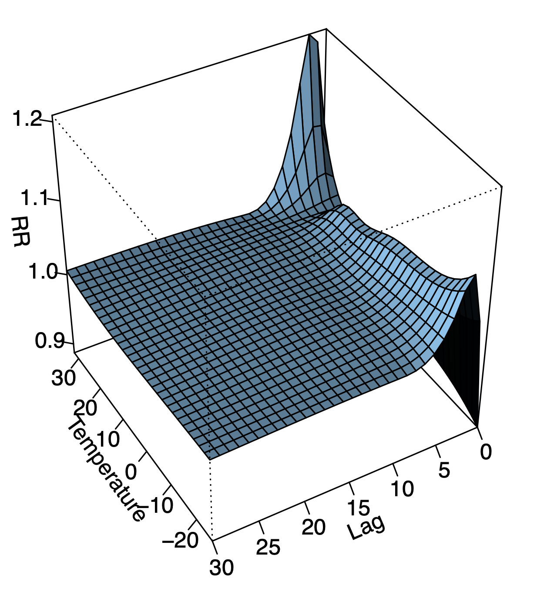

```{r setup, include = FALSE}
library(knitr)
library(rmarkdown)
xaringanExtra::use_panelset()
xaringanExtra::use_clipboard()
# set default options
opts_chunk$set(dpi = 300)
```

class: title-slide, left, bottom

# `r rmarkdown::metadata$title`
----
## **`r rmarkdown::metadata$subtitle`**
### `r rmarkdown::metadata$author`
### `r rmarkdown::metadata$date`

---

# .brand-blue[목차]

.left-column[
]
.right-column[

- .font130[.content-box-blue[모형 소개]]

<br>

- .font130[.content-box-blue[실무 적용 예시]]


<br>

- .font130[.content-box-blue[실습]]

]

---

class: inverse, middle, center

# 모형 소개

---

## .brand-blue[모형 소개]
 <!-- 길이 n(t = 1, 2, ... ,n)인 시계열 Y_t를 outcome으로 모형화하는 DLNM의 기본적인 모형식: -->


\begin{align}
g(\mu_t) = \alpha + s({\boldsymbol{A}}_{t}, {\rm{df}}_p, {\rm{lag}}, {\rm{df}}_l ; {\boldsymbol{\beta}}) + {\boldsymbol{\gamma}}{\boldsymbol{M}}_{t}
\end{align}

.pull-left[

- 시계열 회귀모형

  - .brand-blue[비선형적 효과]와 .brand-blue[지연 효과(delayed effect)] 반영 가능

<!-- 일반적으로 연구 대상이 개인인 다른 연구 방법과 달리 생태학적 연구에서는 인구집단이 대상. 예를 들면, 동일한 시대에 다른 지역의 인구 집단인 국가 간의 질병 발생률과 사망률을 비교하는 연구 등이 해당함 -->

- 생태학적 연구(ecological study)

  - .brand-blue[환경적 요인(stressor)]으로 Outcome( $Y_t$ ) 모델링
  - 특정 .brand-blue[예측변수] $X_t$.brand-blue[(exposure)]의 효과는 관측 시점 당시 뿐만이 아닌 .brand-blue[지연 효과] 빈번히 존재
]

.pull-right[
```{r DLNM, echo = FALSE, out.height = 350, fig.cap = "Fig 1. Gasparrini (2011)"}

``` 
]

---

class: inverse, middle, center

# 실무 적용 예시

---
## .brand-blue[실무 적용 예시]

\begin{align}
{\rm{log}}(E(Y_{ijt})) = \alpha + {\rm{NS}}({\boldsymbol{A}}_{ijt}, {\rm{df}}_p, {\rm{lag}}, {\rm{df}}_l ; {\boldsymbol{\beta}}_{ij}) + {\boldsymbol{\gamma}}_{ij}{\boldsymbol{M}}_{ijt} + {\boldsymbol{\delta}}_{ij}{\boldsymbol{S}}_{t} 
\end{align}

.pull-left[
 - 우리나라 6개 대도시에 대해 6종의 대기오염원이 정신과 질환에 미치는 건강영향평가 수행
  
  - 대기오염원(exposure): ${\rm{PM}}_{10}$, ${\rm{PM}}_{2,5}$, ${\rm{NO}}_{2}$, ${\rm{SO}}_{2}$, ${\rm{O}}_{3}$, ${\rm{NO}}_{2}$
  - 기상요인(covariates): 강수량, 상대습도, 풍속, 기온, 일교차
  - 🔗 [데이터 제공](https://github.com/G-ABCwork/Data_Useful)
  
- .brand-blue[Single exposure DLNM] 고려

]

.pull-right[
 - 최적화 알고리즘 개발
  - Maximum lag days( ${\rm{lag}}$ ): $[7, 8, \cdots, 31]$
  - Degrees of freedom in predictor space( ${\rm{df}}_p$ ): $[2, 3, 4, 5]$
  - Degrees of freedom in additional lag dimension ( ${\rm{df}}_l$ ): $[2, 3, 4, 5]$
  
- 다변량 메타분석 수행

  - 6개 대도시에 관한 분석 결과 통합
  
  - (Gasparrini, Armstrong, and Kenward 2012)
]

---

class: inverse, middle, center

# 실습

---

.scroll-output[

 .pull-left[

## .brand-blue[패키지 설치 및 로딩]

```{r, eval = FALSE}
install.packages(c("tidyverse", "dlnm", 
                   "splines", "stringr", 
                   "lubridate"))
```

```{r, message = FALSE}
library(tidyverse)
library(dlnm)
library(splines)
library(stringr)
library(lubridate)
ggplot2::theme_set(theme_bw())
```
]

.pull-right[
 
## .brand-blue[데이터 불러오기]

- {dlnm} 패키지의 1987-2000년 시카고의 일별 사망건수, 기상요인, 대기오염원에 관한 정보가 담겨있는 `chicagoNMMAPS` 자료 이용

```{r}
chicago <- chicagoNMMAPS |> 
    as_tibble() |> 
    select(date, time, year, pm10, temp, death)
glimpse(chicago)
```

 
]


]

---

.pull-left[

## .brand-blue[데이터 출력]

```{r}
head(chicago)
```


]

.pull-right[

## .brand-blue[EDA]

```{r EDA, warning = FALSE, fig.height=3.5, fig.retina = 2, fig.align = "center"}
chicago |> 
    ggplot(aes(x = date, y = pm10)) + 
    geom_line()
```

]

---

.scroll-output[

## .brand-blue[Cross-basis matrix 만들기]

```{r}
cb_pm <- crossbasis(chicago$pm10,
                    lag = 14,
                    argvar = list(fun = "ns", df = 3),
                    arglag = list(fun = "ns", df = 3))
summary(cb_pm)
```

]

---

## .brand-blue[모형 적합]

```{r}
num_year <- chicago |> 
    select(year) |> 
    unique() |> 
    nrow()
mod <- glm(death ~ cb_pm + temp + ns(time, 7*num_year), 
           family = quasipoisson(), data = chicago)
```   

## .brand-blue[예측 수행]
```{r}
pred_pm <- crosspred(cb_pm, mod, 
                     cen = chicago$pm10 |> 
                         median(na.rm = T),
                     at = 10:80, by = 1)
```

---

## .brand-blue[분석 결과 시각화]

.pull-left[

### .black[3D plot]

```{r 3d, warning = FALSE, fig.height=5.5, fig.retina = 2, fig.align = "center"}
plot(pred_pm, xlab = "PM10", zlab = "RR",
     theta = 210, phi = 30, lphi = 30, border = "gray40")
```

]

.pull-right[

### .black[Contour plot]
```{r contour, warning = FALSE, fig.height=5.5, fig.retina = 2, fig.align = "center"}
plot(pred_pm, "contour", xlab = "PM10", ylab = "Lag",
     key.title = title("RR"))
```

]

---

## .brand-blue[분석 결과 시각화]

### .black[Overall cumulative association plot]

.pull-left[
```{r OCA-code, eval = FALSE,warning = FALSE, fig.height=3,fig.retina = 2, fig.align = "center"}
plot(pred_pm, "overall", col = "tomato", 
     lwd = 2, xlab = "PM10", ylab = "RR")
rug(chicago$pm10, quiet = TRUE)
``` 
]

.pull-right[
```{r OCA-show, echo = FALSE,warning = FALSE, fig.height=6,fig.retina = 2, fig.align = "center"}
plot(pred_pm, "overall", col = "tomato", lwd = 2, xlab = "PM10", ylab = "RR")
rug(chicago$pm10, quiet = TRUE)
```  
]

---

## .brand-blue[분석 결과 시각화]

### .black[High PM10 effect]

.pull-left[
```{r high-code, eval = FALSE, warning = FALSE, fig.height=6, fig.retina = 2, fig.align = "center"}
plot(pred_pm, "slices",
     var = chicago$pm10 |> 
         quantile(0.9, na.rm = TRUE) |> 
         round(0),
     col = "tomato", lwd = 2, ylab = "RR", 
     main = "High PM10 effect (vs 90th quantile)")
```
]

.pull-right[
```{r high-show, echo = FALSE, warning = FALSE, fig.height=6, fig.retina = 2, fig.align = "center"}
plot(pred_pm, "slices",
     var = chicago$pm10 |> 
         quantile(0.9, na.rm = TRUE) |> 
         round(0),
     col = "tomato", lwd = 2, ylab = "RR", 
     main = "High PM10 effect (vs 90th quantile)")
```
]

---

## .brand-blue[분석 결과 시각화]

### .black[Low PM10 effect]

.pull-left[
```{r low-code, eval = FALSE, warning = FALSE, fig.height=6, fig.retina = 2, fig.align = "center"}
plot(pred_pm, "slices",
     var = chicago$pm10 |> 
         quantile(0.1, na.rm = TRUE) |> 
         round(0),
     col = "tomato", lwd = 2, ylab = "RR", 
     main = "Low PM10 effect (vs 10th quantile)")
```

]

.pull-right[
```{r low-show, echo = FALSE,warning = FALSE, fig.height=6, fig.retina = 2, fig.align = "center"}
plot(pred_pm, "slices",
     var = chicago$pm10 |> 
         quantile(0.1, na.rm = TRUE) |> 
         round(0),
     col = "tomato", lwd = 2, ylab = "RR", 
     main = "Low PM10 effect (vs 10th quantile)")
```


]

---
class: inverse, middle, center

# References

---

## .brand-blue[References]

[1] Gasparrini, Antonio, Benedict Armstrong, and M.G. Kenward. “Distributed Lag Non-Linear Models.” Statistics in Medicine 29 (September 20, 2010): 2224–34. https://doi.org/10.1002/sim.3940.

[2] Gasparrini, Antonio. “Distributed Lag Linear and Non-Linear Models in R: The Package Dlnm.” Journal of Statistical Software 43 (July 1, 2011): 1–20. https://doi.org/10.18637/jss.v043.i08.

---

class: inverse

# Thanks!

.pull-right[.pull-down[

<a href="mailto:favorite@kakao.com">
.white[`r icons::fontawesome("paper-plane")` favorite@kakao.com]
</a>

<a href="https://github.com/be-favorite">
.white[`r icons::fontawesome("github")` @be-favorite]
</a>

<a href="https://twitter.com/TaemoBang">
.white[`r icons::fontawesome("twitter")` @TaemoBang]
</a>

<a href="https://github.com/be-favorite/Presentation_archive">
.white[`r icons::fontawesome("link")` Presentation archive]
</a>

<br><br><br>

]]